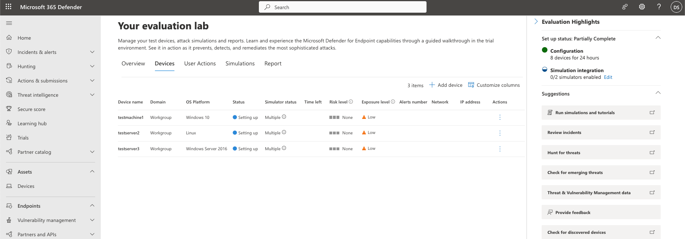
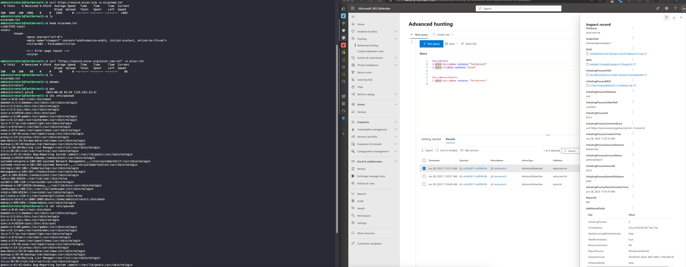
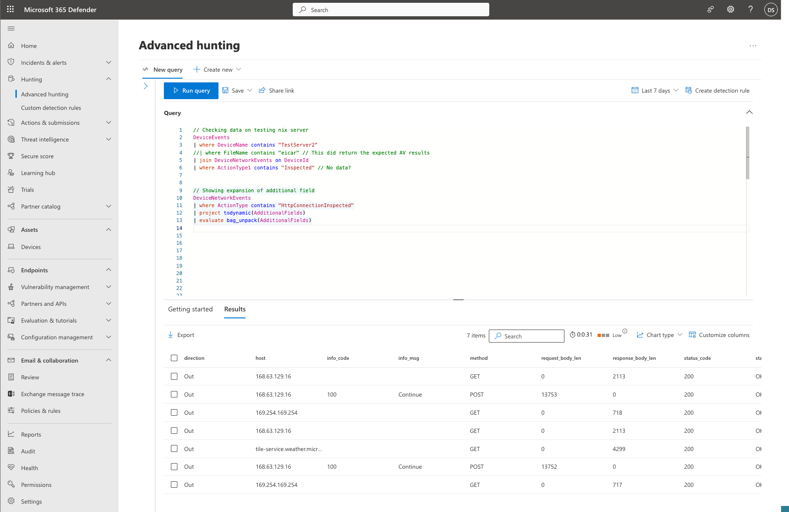
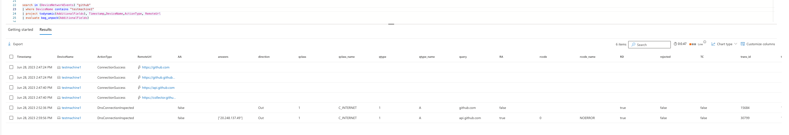
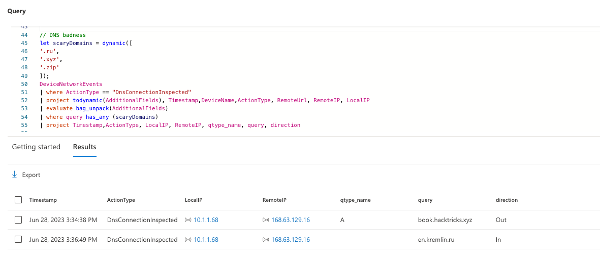
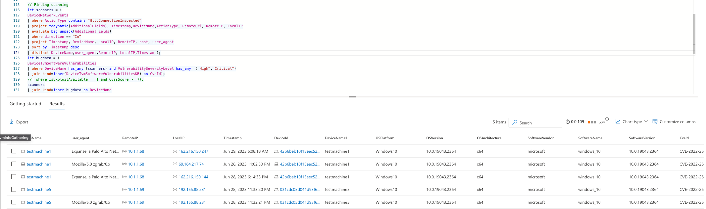

# Zeek
 

## Goals
In this blog we are going to 
> Understand the new Zeek data available in Microsoft Defender 365\
> Build an evaluation lab and run some attacks to generate telemetry\
> Surface this activity in advanced hunting\
> Look at some  detection opportunities a

## Whats it about

Back in November 2022, Microsoft announced they were intergrating Zeek with Microsoft Defender for Endpoint for deep packet inspection. For detection engineers, this data is buried in the advanced hunting DeviceNetworkEvents table under the Action Type field with the value containing "ConnectionInspected".  You can read more about Zeek here - [Zeek Documentation — Book of Zeek (git/master)](https://docs.zeek.org/en/master/index.html)


|   |   |   |
|---|---|---|
|**Protocol / Signature Name**|**Old Action Type**|**New Action Type**|
|**SSH**|NetworkSignatureInspected|SshConnectionInspected|
|**FTP_Upload**|NetworkSignatureInspected|FtpConnectionInspected|
|**FFP_Client**|NetworkSignatureInspected|FtpConnectionInspected|
|**HTTP_Client**|NetworkSignatureInspected|HttpConnectionInspected|
|**HTTP_Server**|NetworkSignatureInspected|HttpConnectionInspected|
|**HTTP_RequestBodyParameters**|NetworkSignatureInspected|HttpConnectionInspected|
|**HTTPS_Client**|NetworkSignatureInspected|SslConnectionInspected|
|**DNS_Request**|NetworkSignatureInspected|DnsConnectionInspected|

Fig1 - [Enrich your advanced hunting experience using network layer signals from Zeek (microsoft.com)](https://techcommunity.microsoft.com/t5/microsoft-defender-for-endpoint/enrich-your-advanced-hunting-experience-using-network-layer/ba-p/3794693?WT.mc_id=AZ-MVP-5004810)

The most relevant data lives, as is tradition, in AdditionalFields as a JSON data structure. Annoying to parse in MDE Advanced hunting, easy in sentinel if you have the luxury of streaming your raw MDE data types to the sentinel connection - [Support for Microsoft 365 Defender connector data types in Microsoft Sentinel for different clouds (GCC environments) | Microsoft Learn](https://learn.microsoft.com/en-us/azure/sentinel/microsoft-365-defender-cloud-support)


|   |   |
|---|---|
|Field Name|Description|
|direction|The direction of the conversation relevant to the Defender for Endpoint-onboarded device, where the values are either ‘In’ or ‘Out’|
|conn_state|The state of the connection. In the screenshot example OTH means that no SYN packet was seen. Read the [Zeek](https://docs.zeek.org/en/master/scripts/base/protocols/conn/main.zeek.html) documentation for more information on conn_state.|
|duration|The length of the connection, measured in seconds|
|missed_bytes|Indicates the number of bytes missed in content gaps, representing packet loss.|
|orig_bytes|The number of payload bytes the originator sent. For example, in ICMP this designates the payload size of the ICMP packet.|
|orig_ip_bytes|The number of IP level bytes that the originator sent as seen on the wire and taken from the IP total_length header field.|
|orig_pkts|The number of packets that the originator sent.|
|resp_bytes|The number of payload bytes the responder sent.|
|resp_ip_bytes|The number of IP level bytes that the responder sent as seen on the wire.|
|resp_pkts|The number of packets that the responder sent.|
|Uid|Unique Zeek ID of the transaction.|


## Setting up our Evaluation lab

I work in a regulated environment with a ton of juicy data, but alas I can't expose this data to the public and expect to still pay rent.
Luckily, Microsoft provide a "Microsoft Defender for Endpoint evaluation lab" which can be accessed with a free trial. The free trial gives you 3 months of access and a P2 licence, which is a pretty good deal.
I won't detail the sign up steps here, but its simple and takes a few minutes with no credit card needed. Just create a new user and tenancy and get dropped into a blank Microsoft 365 Defender console. You can find the setup steps here [Microsoft Defender for Endpoint evaluation lab | Microsoft Learn](https://learn.microsoft.com/en-us/microsoft-365/security/defender-endpoint/evaluation-lab?view=o365-worldwide)


Once we have access, we just need to follow the steps in the above guide to provision the evaluation lab. This will take a while, so best to do something in the interim.


I've set the environment up as so, deciding against any of the Simulation integrations at first, as I want to see if I get access to an endpoint and can just run atomic redteam on it, as I didn't feel like sharing my data with another vendor. You can read more about atomic redteam here [GitHub - redcanaryco/atomic-red-team: Small and highly portable detection tests based on MITRE's ATT&CK.](https://github.com/redcanaryco/atomic-red-team) and from my jaded perspective, both of these products probably use some portion of atomic under the hood. Reading the doco, you can also run Microsofts DIY attack scenarios and access the machines via Ransomware Deployment Protocol (RDP) the "Actions - Connect" function on the screenshot below.

So far I have only added 5 of my 8 allocated devices. 



testserver2 = nix attack machine\
testmachine1 = Victim Windows 10\
testserver3 = Victim server\
Testserver4 = DC\
testmachine5 was created automatically after creating the domain controller\


And we can see we already have some data in there form my testing on the linux server, however when checking the zeek logs - I don't see any activity for this machine and it turns out that is because it isn't supported! *we extended Zeek to support Windows-based systems* [Microsoft Defender for Endpoint now integrated with Zeek](https://techcommunity.microsoft.com/t5/microsoft-defender-for-endpoint/new-network-based-detections-and-improved-device-discovery-using/ba-p/3682111)



The second query is a way to expand out all the fields stored in the JSON object using the bag_unpack function, I like this as an overview of what data is available.



##  What can we find

*Note: None of these detections are production ready, they are just examples to outline the data I found whilst digging into the new(ish) data source*

Firstly, I started off on the Windows 10 victim, testmachine1 but hit a few snags. I wasn't able to install the Atomics folder that contains the definitions for atomics red team. EDR was blocking this and I wasn't able to disable this via the gui, registry or Set-MpPreference. I would guess that Microsoft don't want you actually killing the product you're meant to be evaluating and I didn't want to get stuck in a rabbit hole on an ephemeral machine. I checked the Simulation available in MDE and found Atomic was there anyway.

The Atomic simulation is just a batch file that contains 10 sample tests like dumping lsass, renaming Microsoft binaries for execution, schtask creation and only one command that reached out using to the atomic github using New-Object Net.WebClient, surely we can find that.

###  Test 1, finding New-Object Net.WebClient).DownloadString('https://raw.githubusercontent.com/redcanaryco/


I've redacted the full command in this doco, but did a really broad search across the DeviceNetworkEvents table, and returned no results for the explicit URL containing "redcanaryco". Searching again for github, I found two DnsConnectionInspected entries from Zeek. Kind of helpful as a way to start understanding the data available to us but sad we didn't get great visibility to the specific repo. Lets see what we can do with the DNS requests.



### Test 1, Detection ideas

- DNS requests to suspicious domains
```
// DNS badness
let scaryDomains = dynamic([
'.ru',
'.xyz',
'.zip'
]);
DeviceNetworkEvents
| where ActionType == "DnsConnectionInspected"
| project todynamic(AdditionalFields), Timestamp,DeviceName,ActionType, RemoteUrl, RemoteIP, LocalIP
| evaluate bag_unpack(AdditionalFields)
| where query has_any (scaryDomains)
| project Timestamp,ActionType, LocalIP, RemoteIP, qtype_name, query, direction
```

*In Russia, DNS queries YOU*

- Possible DNS exfiltration or tunnelling using traffic analysis
For this one, you would want to baseline your environment to define what is 'normal' and possible create an exclusion list for noisy but benign endpoints. You could also scope this to only search on specific device types and put in a detection rule to alert when the number exceeds the allowable (for your environment) threshold.

```
// DNS tunneling - Network
DeviceNetworkEvents
| where ActionType == "DnsConnectionInspected"
| project todynamic(AdditionalFields), Timestamp,DeviceName,ActionType, RemoteUrl, RemoteIP, LocalIP
| evaluate bag_unpack(AdditionalFields)
| summarize count()by LocalIP
| sort by count_
```


+ DNS Summary. This is a good alerting source, but made even better if you don't have a fancy enterprise proxy or IPS from some of the big and expensive behemoths. It won't replace your Palo or Zscaller (if you're lucky enough to have them) but its a good complimentary detection source for those who do and a great way to get visibility for those who don't. 


### Test 2, Finding what is hitting your exposed endpoints

Scanning is a little contentious on wether to alert or not, because for a long time you didn't have great vulnerability data on the endpoint and you can't really help it.
Microsoft have a DeviceTvmSoftwareVulnerabilities table that lists known CVEs that impact your endpoints. This makes finding scanning a little more attractive. You can have a quick look at what is hitting your internet exposed endpoints using a query like the below.

### Test 2, Detection Ideas

```
// Finding scanning
DeviceNetworkEvents
| where Timestamp < ago(1h)
| where ActionType contains "HttpConnectionInspected"
| project todynamic(AdditionalFields), Timestamp,DeviceName,ActionType, RemoteUrl, RemoteIP, LocalIP
| evaluate bag_unpack(AdditionalFields)
| where direction == "In"
| project Timestamp, DeviceName, LocalIP, RemoteIP, host, user_agent
| sort by Timestamp desc
```

We can then stitch this with the Vulnerabilities tables to get an idea of the potential exposure where the bug has an exploit available.
If you wanted to be fancy, you could use the externaldata function and pull in a threat feed and do some classification on what is hitting your endpoint. You could also create a list of assets that are likely to have a high impact to the org if exploited and do some risk scoring on user_agents and ip addrs.
```
let scanners = (
DeviceNetworkEvents
| where ActionType contains "HttpConnectionInspected"
| project todynamic(AdditionalFields), Timestamp,DeviceName,ActionType, RemoteUrl, RemoteIP, LocalIP
| evaluate bag_unpack(AdditionalFields)
| where direction == "In"
| project Timestamp, DeviceName, LocalIP, RemoteIP, host, user_agent
| sort by Timestamp desc
| distinct DeviceName,user_agent,RemoteIP, LocalIP,Timestamp);
let bugdata = (
DeviceTvmSoftwareVulnerabilities
| where DeviceName has_any (scanners) and VulnerabilitySeverityLevel has_any ("High","Critical")
| join kind=inner(DeviceTvmSoftwareVulnerabilitiesKB) on CveId
| where IsExploitAvailable == 1 and CvssScore >= 7);
scanners
| join kind=inner bugdata on DeviceName
```


git